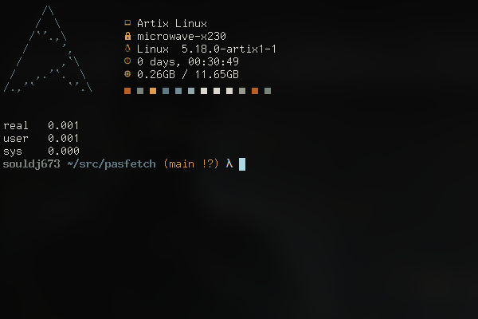

# Pasfetch

My personal build of [Drunken Alcoholic](https://gitlab.com/DrunkenAlcoholic)'s [Pasfetch](https://gitlab.com/DrunkenAlcoholic/pasfetch/), a simple fetch program written in Pascal.


## Screenshot


## Installation
You can compile Pasfetch with the free and open source "Free Pascal Compiler". Just search your distro's packages for "fpc" and install, then compile by doing the following:

### Compile
Use fpc to compile with optimizations
```bash
$ fpc -O3 -CpCOREAVX2 -OpCOREAVX2 -CfAVX2 -Xs pasfetch.pas
```
or run the included shell script to compile and cleanup
```bash
$ ./cleanup.sh
```
If you get an error on "ld" not found, install the "binutils" package for your distribution

### Install
 Copy the compiled binary to a folder in your $PATH e.g "$HOME/.local/bin"
 
 then make it executable
 ```bash
 $ chmod +x pasfetch
 ```

## Usage
Either call the program by using pasfetch in a shell or add to your shell's rc file.

```bash
$ pasfetch
```

## Why
I came across this by accident one day, and it happened to be significantly faster than what I was using previously, especially over 1000 runs.  Using it as intended, the difference was negligible.  I still switched though because I prefer to get free performance where possible, and I like to toy around with old hardware, and so this difference could be much more substantial there.

## Todo
- [ ] Use built-in Crt implementation
- [ ] Allow running without clearing screen
